# 遗传疾病和个体特征知识图谱的搭建，以及与药物基因组图谱的融合

目录：

[TOC]

本项目基于OMIM疾病及表型数据，HPO人类表型数据， GWAS个体特征研究报告数据以及pubmed中与基因、疾病、表型的论文文本数据解析，
搭建了遗传疾病和个体特征知识图谱。

并且在基因、基因变异、疾病的节点上，与之前开发的药物基因组知识图谱进行了节点融合，将两张子图构建成为了具有超过234万个节点，486万个关系边，2162万个属性的大图。

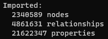
<div>图1.图谱规模统计</div>

## 知识图谱的原型设计
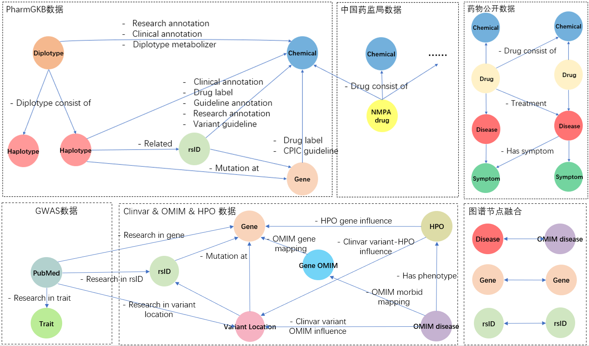
<div>图2.遗传疾病和个体特征知识图谱设计原型，点击查看大图</div>
<br>

该图**上半部分**展示的是药物基因组知识图谱的原型，该图谱的具体细节可以参考药物基因组知识图谱项目
[github](https://github.com/johncolezhang/pgkb_graph) or [gilab wiki](https://gitlab.omgut.com/zhangke1/pgkb_graph/-/wikis/BGE%E7%9F%A5%E8%AF%86%E5%9B%BE%E8%B0%B1%E4%BB%8B%E7%BB%8D)
，图谱的使用教程也可以参考这个gitlab wiki。

该图的**下半部分**是本次图谱设计的原型。从左到右开始：

- 1. 基于[GWAS catalog associations](https://www.ebi.ac.uk/gwas/docs/file-downloads) 里关于PubMed论文中与个体特征相关的研究数据，
并且收集了PubMed论文中研究的基因，基因变异以及位点的数据。从PubMed节点出发设计的子图。

- 2. 基于[Clinvar variant summary](https://ftp.ncbi.nlm.nih.gov/pub/clinvar/tab_delimited/variant_summary.txt.gz) 里面关于遗传疾病的数据，
从变异点位出发，收集了变异点位的坐标及所在的基因、遗传方式、表型、是否致病、关联的OMIM id、HPO id、以及评审结果等数据，
从变异点位出发设计出与基因、rsID、HPO、OMIM相连的一张子图。

- 3. 从[OMIM疾病数据](https://omim.org/downloads) 和 [HPO表型数据](https://hpo.jax.org/app/download/annotation) 中补充了OMIM节点以及HPO节点的数据；
以及OMIM到基因，HPO到基因的关系数据。

最后为了让新的遗传疾病个体特征知识图谱和之前药物基因组知识图谱做融合，在两个图中相同的基因节点以及rsID节点做了融合，
在OMIM疾病节点和药物适应症节点上，使用文本相似度计算，清洗文本后使用阈值为80%的最短编辑距离比算法，合并OMIM疾病节点和药物适应症节点。

图谱上传至Neo4j之后，运行命令显示图谱连接关系，显示如下：
```
// Neo4j cypher
call db.schema.visualization
```
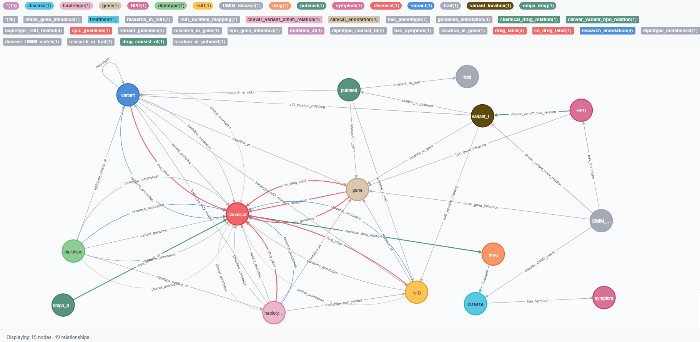
<div>图3.Neo4j中的图谱schema，点击查看大图</div>

## 图谱数量统计
### 节点统计：
```
// Neo4j cypher
CALL db.labels() YIELD label
CALL apoc.cypher.run(
    'MATCH (:`'+label+'`) RETURN count(*) as count',
    {}
) YIELD value
RETURN label, value.count
```

|节点类型   | 个数   | 节点类型   | 个数   |
|---|---|---|---|
| OMIM_disease  | 7299  | chemical  | 952  |
| HPO  | 11896  | diplotype  | 16672  |
| variant_location  | 1112851  | disease  | 8802  |
| variant  | 970320  | drug  | 20538  |
| rsID  | 968765  | nmpa_drug  | 33703  |
| pubmed  | 96213  | symptom  | 5998  |
| gene  | 49214  | haplotype  | 1555  |
| trait  | 6131  | | |

### 关系统计：
```
// Neo4j cypher
CALL db.relationshipTypes() YIELD relationshipType as type
CALL apoc.cypher.run(
    'MATCH ()-[:`'+type+'`]->() RETURN count(*) as count',
    {}
) YIELD value
RETURN type, value.count
```

| 边类型  | 个数  | 边类型  | 个数  |
|---|---|---|---|
| clinvar_variant_omim_relation  | 683701  | clinvar_variant_hpo_relation  | 115326  |
| has_phenotype  | 57593  | rsID_location_mapping  | 834448  |
| research_in_gene  | 167799  | research_in_rsID  | 241184  |
| omim_gene_influence  | 25272  | hpo_gene_influence  | 107501  |
| chemical_drug_relation  | 3534  | clinical_annotation  | 20876  |
| cn_drug_label  | 73  | cpic_guideline  | 442  |
| diplotype_consist_of  | 32435  | diplotype_metabolizer  | 10292  |
| drug_consist_of  | 33700  | drug_label  | 1445  |
| guideline_annotation  | 5806  | haplotype_rsID_related  | 786  |
| has_symptom  | 54012  | mutation_at  | 8179  |
| research_annotation  | 4317  | treatment  | 91186  |
| variant_guideline  | 72  | disease_OMIM_match  | 1322  |
| location_in_gene  | 1055077  | location_in_pubmed  | 1295455  |
| research_in_trait  | 9798  |   |   |


## 节点详情
这里介绍本次新图谱里重点加入的节点类型：**PubMed**, **variant_location**, **OMIM_disease**, **Trait**, **HPO**

### PubMed节点
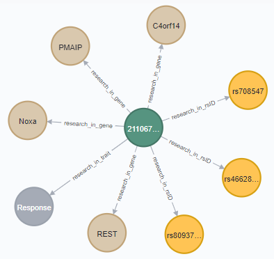
<div>图4.PubMed在Neo4j中的显示</div>
<br>
 
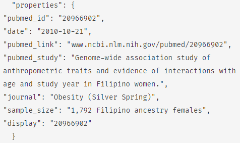
<div>图5.PubMed节点属性</div>
<br>

PubMed节点与基因节点、rsID节点、个体特征节点相连，记录了论文发表的期刊、论文研究的主题等信息，
通过关系边可以查询到论文中研究的基因，rsID以及个体特征节点。在`research_in_rsID`类型的关系边属性中，
还记录了rsID在研究中的相关性置信度值为多少，后续查询使用时可以根据置信度阈值，筛选关联性更大的rsID进行分析：


<div>图6.reserch_in_rsID 关系边置信值属性</div>

### 个体特征节点Trait
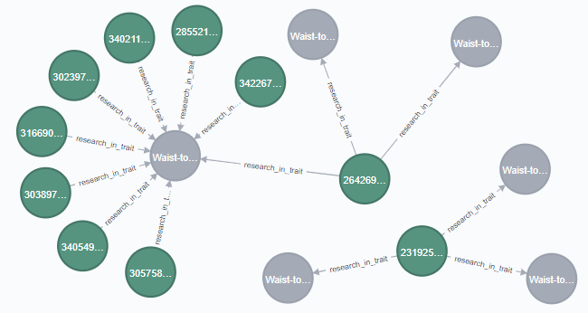
<div>图7.个体特征节点在Neo4j中的显示(灰色节点)</div>
<br>

个体特征节点与PubMed节点相连，通过PubMed节点与基因、基因变异的关系边，可以遍历到影响个体特征的基因和变异。

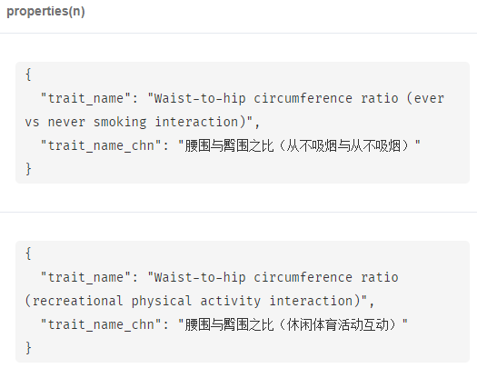
<div>图8.个体特征节点属性</div>

### OMIM_disease节点
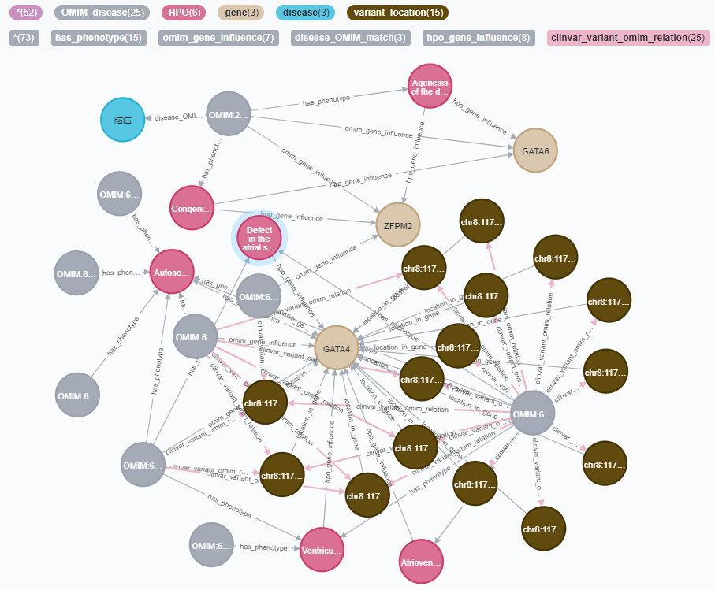
<div>图9.OMIM节点在Neo4j中的显示(灰色节点)</div>
<br>

OMIM节点中储存了该疾病的标准名称、表型以及遗传模式。OMIM节点在图谱中与人类表型HPO节点、基因节点、变异点位节点、药物适应症节点相连。

- **OMIM<->变异点位，OMIM<->基因** 的连接关系表示：在clinvar中，OMIM疾病与一系列变异点位及基因有关，具体的相关性重要程度在变异点位节点的属性中。
- **OMIM<->HPO** 的连接关系表示：OMIM疾病与人类表型HPO的具体类型相关。
- **OMIM<->药物适应症**的连接关系表示：从OMIM的标准疾病名称中，可以匹配到药物基因组图谱中的药物适应症节点，该关系是通过文本相似度匹配得到的。

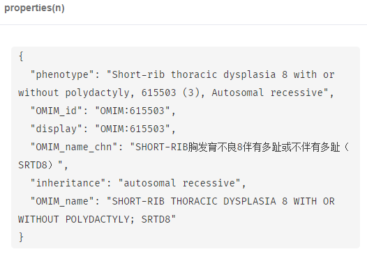
<div>图10.OMIM节点属性</div>

### variant_location节点
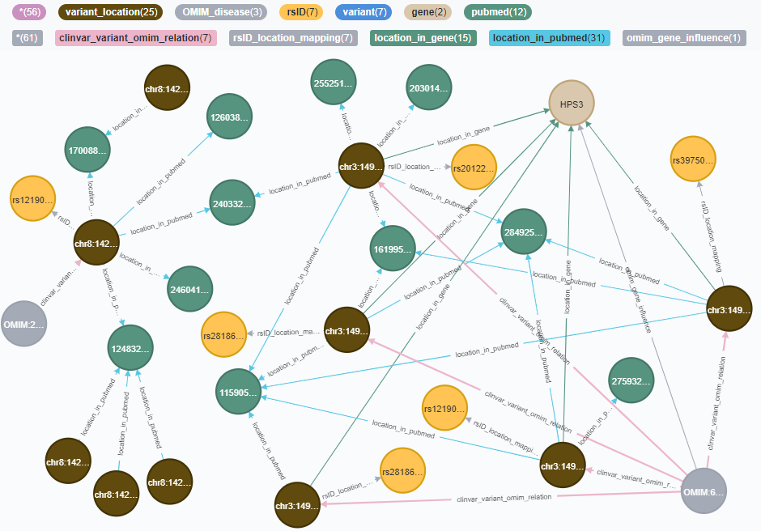
<div>图11.变异点位节点在Neo4j中的显示</div>
<br>

变异点位中存储了一系列的属性数据，包括：位点坐标、变异类型、所在基因、表型、是否致病、审查状态、审查分数(0-4)等数据。

- **变异点位<->rsID，变异点位<->gene** 的连接关系表示：变异点位位于该gene中，并且被该rsID包含.
- **变异点位<->PubMed** 的连接关系表示：通过PubMed[论文引用数据 var_citation](https://ftp.ncbi.nlm.nih.gov/pub/clinvar/tab_delimited/var_citations.txt) 的变异位点及PubMed关系数据，找到PubMed中变异位点的研究情况。
- **变异点位<->OMIM** 的连接关系表示：在clinvar中，OMIM疾病与一系列变异点位及基因有关，变异位点相关性重要程度在变异点位节点的属性中，例如是否致病、审查分数等属性。

变异点位节点是图谱中占比最高的节点，其个数达到111万+。

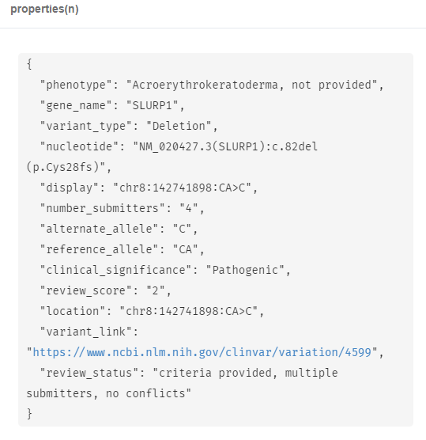
<div>图12.变异点位节点属性</div>

## 图谱分析
图谱分析及使用的详情参考该文件：[analysis.md](analysis.md)

## TODO List
- 开发定时任务获取最新clinvar及gwas数据，对图谱定期更新。
- 找到更新的位点信息重点标识。
- 在开放平台开发数据管理后台。